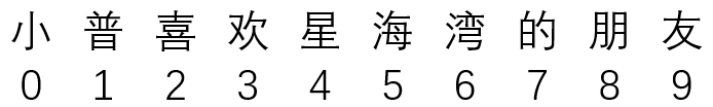
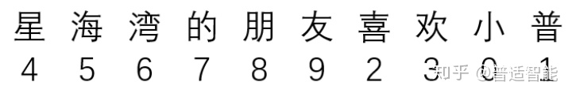
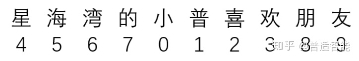
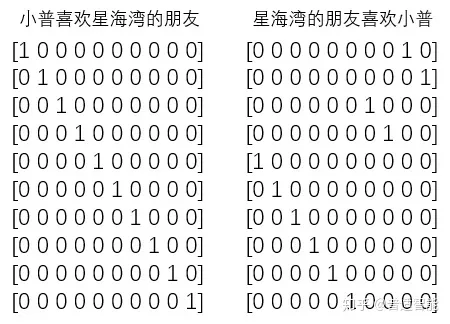
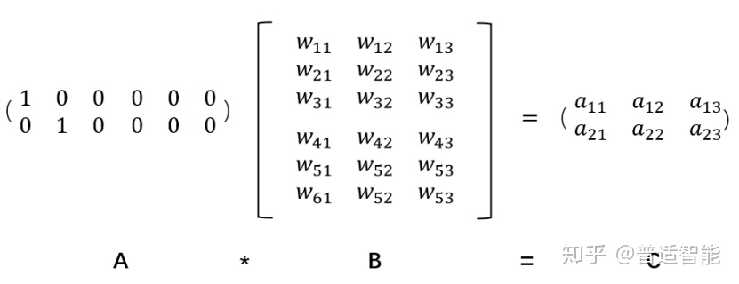
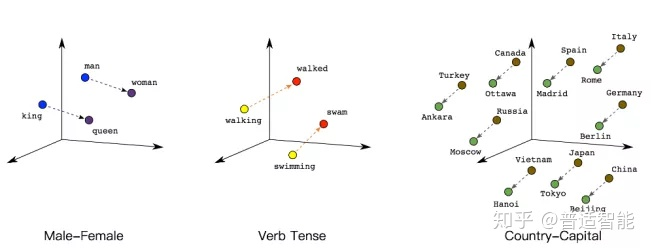

# Embedding

摘要：Embedding层，在某种程度上，就是用来降维的，降维的原理就是矩阵乘法。

## **什么是Embedding？**

近年来，NLP自然语言处理、推荐系统，以及计算机视觉已成为目前工业界算法岗的主流方向，无论在哪个领域，对“**Embedding**”这个词概念的理解都是每个庞大知识体系的基石。

今天我们就以诙谐生动的方式来理解一下这个看似高大上的名词吧。

“Embedding”直译是**嵌入式、嵌入层**。

看到这个翻译的时候是不是一脸懵圈？什么叫嵌入？意思是牢固地或深深地固定？那么它能把什么嵌入到什么呢？

**很开心地告诉你，它能把万物嵌入万物，是沟通两个世界的桥梁，是打破次元壁的虫洞！**

用数学的话来说：“它是单射且同构的（看到这么好的性质是不是很激动！）”

简单来说，我们常见的**地图**就是对于**现实地理的Embedding**，现实的地理地形的信息其实远远超过三维，但是地图通过颜色和等高线等来最大化表现现实的地理**信息**。

通过它，我们在现实世界里的文字、图片、语言、视频就能转化为计算机能识别、能使用的语言，且转化的过程中信息不丢失。

## **怎么理解Embedding**

首先，我们有一个**one-hot**编码的概念。

假设，我们中文，一共只有10个字，那么我们用0-9就可以表示完。

比如，这十个字就是“小普喜欢星海湾的朋友”

其分别对应“0-9”，如下：

那么，其实我们只用一个列表就能表示所有的对话。

例如：

或者：

但是，经过**one-hot编码**把上面变成：

即：把每一个字都对应成一个十个（样本总数/字总数）元素的数组/列表，其中每一个字都用唯一对应的数组/列表对应，数组/列表的唯一性用1表示。

那问题来了，费老大劲整这个干嘛呢？有什么优势？

很明显，**计算简单**嘛，稀疏矩阵做矩阵计算的时候，只需要把1对应位置的数相乘求和就行，也许你心算都能算出来；而一维列表，你能很快算出来？

何况这个列表还是一行，如果是100行、1000行或1000列呢？所以，one-hot编码的优势就体现出来了，计算方便快捷、表达能力强。

然而，**缺点**也随着来了。

比如：中文大大小小简体繁体常用不常用有十几万，然后一篇文章100W字，你要表示成100W X 10W的矩阵？？？

这是它最明显的缺点：**过于稀疏时，过度占用资源**。

比如：其实我们这篇文章，虽然100W字，但是其实我们整合起来，有99W字是重复的，只有1W字是完全不重复的。

那我们用100W X 10W的岂不是白白浪费了99W X 10W的矩阵存储空间。

**那怎么办？？？**

这时，Embedding层就出现了！

假设：我们有一个2 x 6的矩阵，然后乘上一个6 x 3的矩阵后，变成了一个2 x 3的矩阵。

先不管它什么意思，这个过程，我们把一个A中的12个元素的矩阵变成C中6个元素的矩阵，直观上，大小是不是缩小了一半？

对！！！Embedding层，在某种程度上，就是用来降维的，降维的原理就是**矩阵乘法**。

假如我们有一个100W X10W的矩阵，用它乘上一个10W X 20的矩阵，我们可以把它降到100W X 20，瞬间量级降了10W/20=5000倍！！！

这就是嵌入层的一个作用——**降维**。

接着，既然可以降维，当然也可以升维。

**为什么要升维？**

这张图，如果要你在10米开外找出四处不同！是不是太困难了！当然，目测这是**不可能完成**的。

但是让你在一米外，也许你一瞬间就发现鼻子是不同的，然后再走近半米，你又发现右下角元宝也是不同的。再走近20厘米，又发现耳朵也不同，最后，在距离屏幕10厘米的地方，终于发现第四个不同的地方在眼睛的高光。

但是，其实无限靠近并不代表认知度就高了，比如，你只能距离屏幕1厘米远的地方找，找出四处不同，小普怕不是要被读者打死了。

由此可见，**距离的远近会影响我们的观察效果**。

同理也是一样的，低维的数据可能包含的特征是非常**笼统**的，我们需要不停地拉近拉远来改变我们的感受，让我们对这幅图有不同的观察点，找出我们要的"**茬**"。

Embedding的又一个作用体现了：**对低维的数据进行升维时，可能把一些其他特征给放大了，或者把笼统的特征给分开了**。

同时，这个Embedding是一直在学习在优化的，就使得整个拉近拉远的过程慢慢形成一个良好的观察点。

比如：小普来回靠近和远离屏幕，发现45厘米是最佳观测点，这个距离能10秒就把4个不同点找出来了。

因此它就是作为这个**桥梁**的存在，让我们手头的东西可伸可缩，变成我们希望的样子。

## **语义理解中Embedding意义**

理解了它是沟通两个世界的桥梁后，我们再看个例子，它是如何运用在文本数据中的？

如下图所示，我们可以通过将两个无法比较的文字映射成向量，接下来就能实现对他们的计算。

例如：

queen（皇后）= king（国王）- man（男人）+ woman（女人）

这样计算机能明白，“皇后啊，就是女性的国王呗！”

walked（过去式）= walking（进行时）- swimming（进行时）+ swam（过去式）

同理计算机也能明白，“walked，就是walking的过去式啦！”另外，向量间的距离也可能会建立联系，比方说“北京”是“中国”的首都，“巴黎”是“法国”的首都，那么向量：|中国|-|北京|=|法国|-|巴黎|

**总结：**

Embedding 的基本内容大概就是这么多啦，然而小普想说的是它的价值并不仅仅在于 word embedding 或者 entity embedding 再或者是多模态问答中涉及的 image embedding，而是这种**能将某类数据随心所欲的操控且可自学习的思想**。

通过这种方式，我们可以将**神经网络**、**深度学习**用于更广泛的领域，Embedding 可以表示更多的东西，而这其中的关键在于要想清楚我们需要解决的问题和应用 Embedding 表示我们期望的内容。